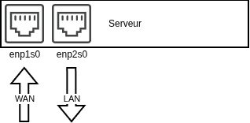
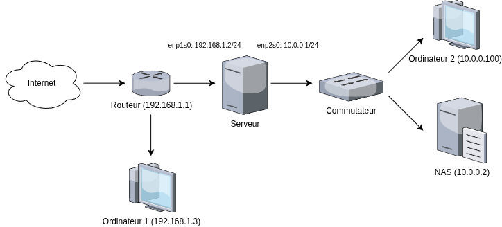
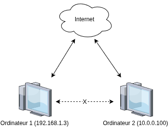

# Création d'un sous-réseau

On aimerait isoler des machines d'un réseau domestiques afin de ne pas empieter sur celui-ci et pour pouvoir gerer plus facilement les adresses à l'avenir.

Les routeurs de base etant trop chers, on décide d'utiliser le serveur principal utilisant Void comme distribution Linux comme routeur car on remarque qu'il a deux ports ethernets pouvant être utilisés comme ça :



Maintenant qu'on est décidé sur quoi utiliser, on imagine ce plan :



## Sous-réseau et serveur DHCP

Déjà, on configure l'IP de notre appareil dans le sous-réseau.

```
sudo ip addr add 10.0.0.1/24 dev enp2s0 
sudo ip link set enp2s0 up
```

Il faut qu'on configure `dnsmasq` pour attribuer les adresses IP a nos appareils connectés au serveur. On commence par l'installer.

```
sudo xbps-install -S dnsmasq
```

On le configure avec `/etc/dnsmasq.conf` :

```
interface=enp2s0
bind-interfaces
dhcp-range=10.0.0.100,10.0.0.254,12h # plage DHCP
dhcp-option=3,10.0.0.1               # adresse Serveur
dhcp-option=6,1.1.1.1,8.8.8.8        # adresses DNS
```

Puis on le lance :

```
sudo ln -s /etc/sv/dnsmasq /var/service
sudo sv up dnsmasq
```

## Attribution d'IP Statique
Maintenant, on veut donner a notre NAS une adresse IP statique. Pour faire ça on peut chercher l'adresse MAC de l'appareil grace a `dnsmasq` :
```
cat /var/lib/misc/dnsmasq.leases
```

```
1777845533 00:00:c0:3d:0d:7d 10.0.0.130 NAS 01:00:00:c0:3d:0d:7d
1777845346 9c:6b:00:c5:69:86 10.0.0.226 * ff:00:c5:69:86:00:01:00:01:31:68:03:98:9c:6b:00:c5:69:86
```

Puis on lui attribue la deuxieme adresse IP dans `/etc/dnsmasq.conf` :
```
dhcp-host=00:00:c0:3d:0d:7d,10.0.0.2 # NAS
```

## IP Forwarding
Maintenant, on a un sous réseau, mais celui-ci ne peut communiquer avec personne. Il faut donc qu'on lui permette d'interagir avec Internet et vice-versa comme sur le diagramme ci-dessous.



```
sudo mkdir -p /etc/sysctl.d/
echo "net.ipv4.ip_forward=1" | sudo tee -a /etc/sysctl.d/10-ipforward.conf
sudo sysctl --system

sudo iptables -t nat -A POSTROUTING -o enp1s0 -j MASQUERADE

sudo iptables -A FORWARD -i enp2s0 -o enp1s0 -j ACCEPT
sudo iptables -A FORWARD -i enp1s0 -o enp2s0 -m state --state ESTABLISHED,RELATED -j ACCEPT

sudo iptables-save | sudo tee /etc/iptables/iptables.rules

sudo ln -s /etc/sv/iptables /var/service
sudo sv up iptables
```
